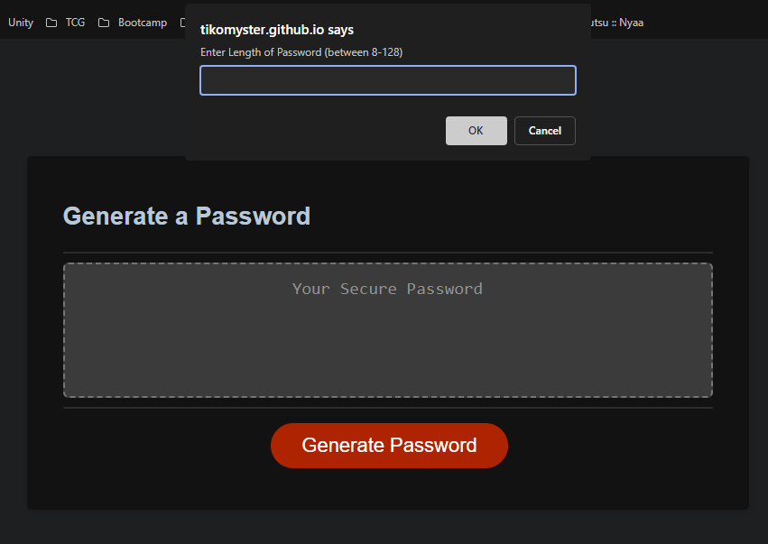

# JavaScript-Password-Challenge

## Description

This project is a password generator. 

It allows users to choose password length between 8 to 128, whether or not to include numbers, lowercase letters, uppercase letters and special characters. 

## Usage

* When a user clicks the 'Generate Password' button, a series of prompts will show up to let the user input a **number** for password length. 
* Then the user selects whether or not to include numbers, lowercase letters, uppercase letters and special characters.
* At least **ONE** type should be selected to generate password. 
* At least **ONE** character from the selected character types will be included in the generated password.
* The animation below shows the web application's appearance and functionality:

## Screenshot

